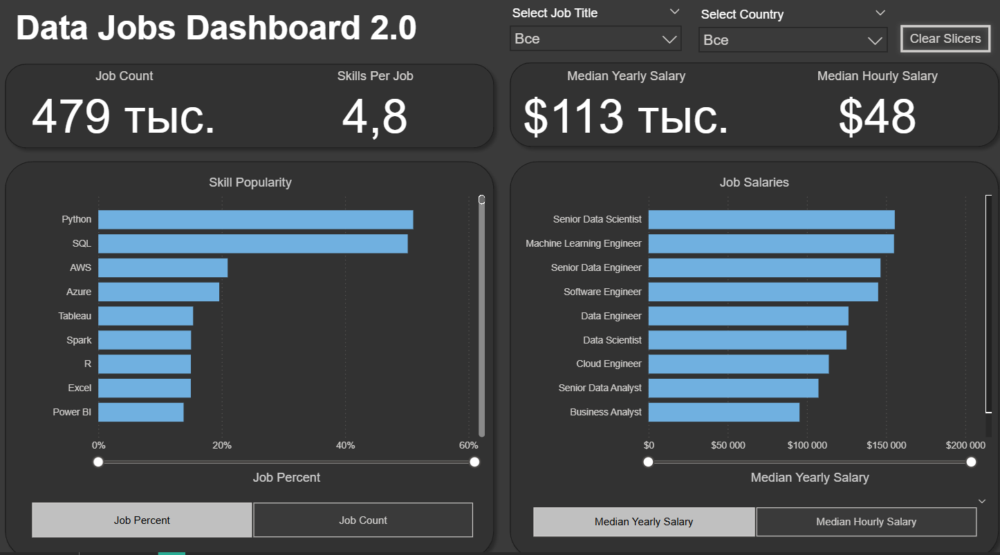
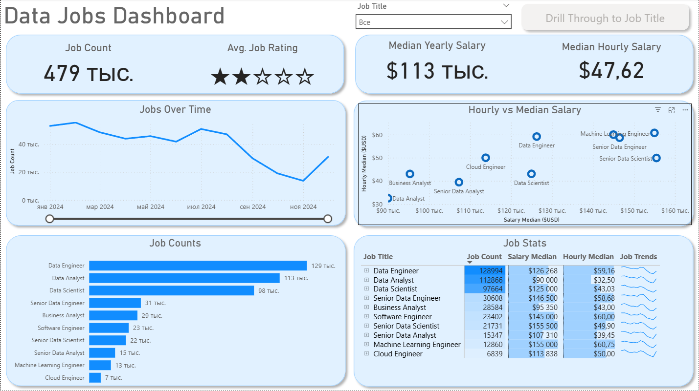

# 📊 Обзор Проекта: Дашборд Вакансий в Сфере Данных (Power BI V2.0)

## Introduction

Navigating the data job market can feel like a maze with information scattered everywhere. This dashboard (V2.0) is designed specifically for **Job Seekers, Job Transitioners, and Job Swappers** to cut through the clutter! Using a real-world dataset of 2024 data science job postings—rich with details on titles, salaries, and locations—this project offers a powerful, **двухстраничный** интерфейс для изучения рыночных тенденций и компенсаций.

> 📁 **Скачать файл дашборда Power BI Desktop (.pbix) можно здесь:** [`Data_Jobs_Dashboard_2.0.pbix`](Data_Jobs_Dashboard_2.0.pbix)

---

### Dashboard File
You can find the file for the dashboard here: [`Data_Jobs_Dashboard_2.0.pbix`](Data_Jobs_Dashboard_2.0.pbix).

## Skills Showcased

This project put key Power BI features into practice. Here's what we mastered:

* **🔗 Data Modeling:** Building efficient data models with relationships (Star Schema principles).
* **⚙️ Power Query ETL:** Performing data cleaning, shaping, and transformation.
* **🧮 DAX Fundamentals:** Creating calculations and aggregations to derive key insights.
* **🎨 Dashboard Design:** Crafting an intuitive and visually appealing report layout.
* **📊 Visualizations Utilized:**
    * **📈 Core Charts, 🗺️ Map Charts, 🔢 Cards, 📋 Tables** for effective data storytelling.
* **🖱️ Interactive Features:**
    * **🎚️ Slicers** for dynamic filtering.
    * **🔘 Buttons & Bookmarks** for streamlined navigation and managing report views (включая Drill-Through).

---

## 📄 Обзор Отчета (Version 2.0 - Две Страницы)

Этот отчет разделен на две страницы, чтобы предоставить пользователю как высокоуровневый обзор, так и возможность глубокой детализации.

### Страница 1: Обзор Рынка (Market Overview)

Эта страница служит вашим командным центром, представляя ключевые метрики (KPI) и общие тенденции.

### Страница 2: Детализация и Сравнение (Drill-Through / Detail)

Эта страница предназначена для глубокого анализа, позволяя сравнить зарплаты по разным должностям, оценить популярность навыков и увидеть детальное распределение вакансий.

---

## 📈 Ключевые Инсайты для Соискателей (Data-Driven Conclusions)

Этот дашборд не просто показывает цифры; он дает уникальные инсайты, помогающие принимать карьерные решения. Вот несколько ключевых выводов, которые можно сделать на основе данных за 2024 год:

### 1. Зарплатный Разрыв и Уровень Должности

* **Наиболее высокооплачиваемые позиции:** Медианная годовая зарплата для **Senior Data Scientist** составляет $155 тыс., что значительно выше, чем у **Data Analyst** ($112 тыс.) и даже **Data Engineer** ($126 тыс.). Это указывает на явную ценность глубокой экспертизы в области машинного обучения и статистики.
* **Сравнение Инженеров и Аналитиков:** **Data Engineer** имеет более высокую медианную зарплату ($126 тыс.) по сравнению с **Data Analyst** ($112 тыс.). Это подтверждает, что спрос на специалистов, владеющих навыками ETL и построением пайплайнов, оплачивается выше, чем чистый аналитический функционал.

### 2. Динамика Рынка

* **Сезонность и Тенденции:** На графике видно, что количество вакансий достигло пика примерно в **апреле–мае 2024** года, а затем наблюдался спад в летние месяцы.
* **Восстановление Рынка:** С ноября 2024 года наблюдается **рост числа вакансий**, сигнализирующий о восстановлении рынка и активизации найма в конце года/начале следующего.

### 3. Насыщенность Рынка

* **Самые востребованные роли:** **Data Engineer** (129 тыс. вакансий) и **Data Analyst** (113 тыс. вакансий) являются самыми многочисленными на рынке.
* **Высокий спрос при низком предложении:** Высокая зарплата для **Machine Learning Engineer** и **Cloud Engineer** может указывать на меньшее количество квалифицированных специалистов в этих узких, специализированных областях.

---

## 💡 Заключение: Ценность Дашборда (Version 2.0)

Этот дашборд успешно выполняет свою главную задачу — превращает разрозненную информацию о рынке труда в сфере данных в **единый, действенный ресурс**. Проект демонстрирует, как с помощью Power BI (Power Query, DAX, визуализация) можно создать полноценный аналитический продукт. Файл `.pbix` доступен для скачивания, что позволяет любому пользователю детально изучить модель данных, логику расчетов и примененные методы преобразования, подтверждая мою готовность к работе с данными.

